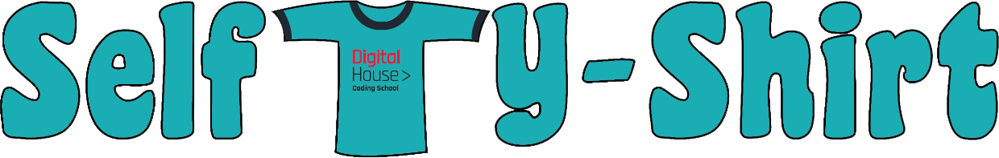

# Selfty Shirt 🛒 

_La personalidad, es el mejor accesorio que puedes llevar. Roberto Cavalli_

En este proyecto desarollamos un sitio web el cual se dedica a la venta de ropa unisex 👕👚 con con diseños propios e innovadores

## Sobre nuestra propuesta 👨‍🏫

El universo del diseño viene ligado a la pasión y a la creatividad, por eso nuestro target se apunta a personas creativas que quieran mostrar su personalidad y carácter a través del diseño o estilo de su ropa, está dirigida a la gente joven y adulta que se sienta libre de expresar.

## ¿Cómo ajustaremos nuestra oferta a ese público? 🛗

Ofrecer la oportunidad de que el público se sienta parte del equipo, con la capacidad de customizar las remeras con el diseño y el estilo que deseen, utilizando materiales que no afecten el medio ambiente, con técnicas aplicables a muchos tipos de superficies y que promuevan la economía sustentable ayudando a seguir demandando el mercado en el sector de las camisetas personalizadas, que actualmente está siendo marcada por la innovación tecnológica y los diseños que se ofrecen.

## Autores ✒️

_Participantes del proyecto durante el desarollo del sitio:_

* **Juan Serrano** - *Project Manager / Full-stack* - Tecnico en Informatica, audiofilo, amante de los videojuegos y entusiasta de perifericos [juanserrano](https://github.com/juaniserrano)
* **Matias Rabinovich** - *Diseño Grafico / Full-stack* - Diseñador multimedial, cinefilo y chef amateur [matrabinovich](https://github.com/matrabinovich)
* **Evisandy Trompiz** - *Documentacion / Full-stack* - Analista de Contenido, de profesión ingeniero con marcada experiencia en la docencia [evitrompiz](https://github.com/evitrompiz)
* **Eglimey Almeida** - *Documentacion / Full-stack* - Especialista en proyecto, sin experiencia en programación o diseño web [almeida-eg](https://github.com/almeida-eg)

## Sitios de Referencia 📝

* https://www.soyturemera.com.ar/ Por los clientes que apuntan, Identidad y audiencia local
* https://www.customink.com/products/ Por los productos que ofrecen  y funcionalidades
* https://www.estampame.com/ Por los clientes que apuntan.
* http://www.maxsublime.com.ar/ Por los productos 
* https://tuinfinity.empretienda.com.ar/ Por los clientes que apuntan y estetica

## Backlog en Trello 📆

Para ver informacion mas detallada de los sprints 🏃

https://trello.com/b/2PA8t0O9/selfty-shirt
